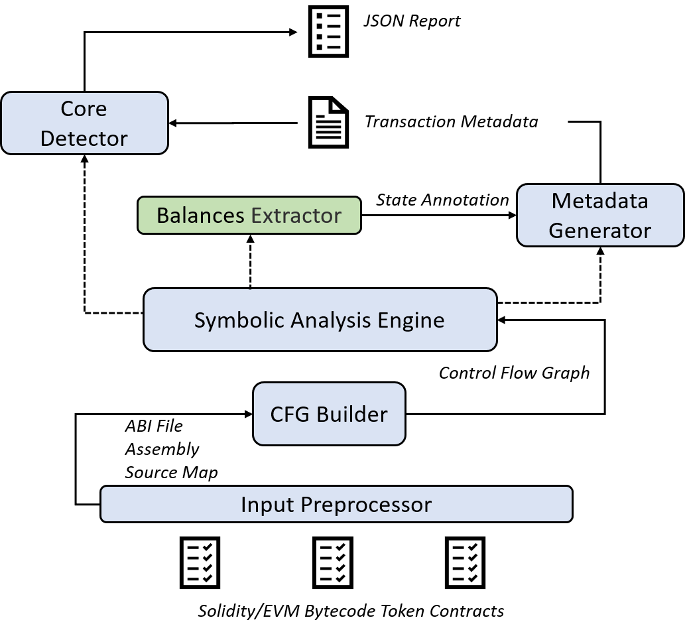

# TSniffer

TSniffer 是面向蜜罐代币的检测器，可检测的蜜罐代币类型包括：
- 带权限的代币转账
	- 仅限白名单用户转账
	- 禁止黑名单用户转账
	- Owner权限控制的可转账开关
- 收取手续费的代币
	- 购买代币收取手续费
	- 售卖代币收取手续费

# Analyze
本节展示 TSniffer的使用规则，TSniffer支持Solidity智能合约和Bytecode两种不同类型的输入


示例:

```
$ python TSniffer.py analyze <solidity-file> -t 3
```

Or:

```
$ python TSniffer.py analyze -f <bytecode-file> -t 3
```

其中，-t 用于指定本次检测构建的交易场景中的最大交易数，最大交易数越高符号执行的检测结果越准确，时间越长。

# Overview

TSniffer 基于多交易组合和符号执行结合的代币安全检测器，其核心理念是遍历合约控制流图中的每个分支，通过符号执行的方式得到每个分支对应的符号摘要信息，而后组合多个符号摘要信息，进而检测蜜罐代币的存在性，其架构图如下：



TSniffer 接收两种类型的输入：Solidity Smart Contract 和 EVM bytecode。

- **Input Preprocessor** 模块生成合约对应的、Assembly和Source Map 用于后续的分析。
- **CFG Builder** 模块构建了待测试合约对应的控制流图 CFG。
- **Symbolic Analysis Engine** 模块负责将状态、变量等符号化，并符号执行 CFG 的每个分支，并将符号化的信息输入 **Metadata Generator**。
- **Balances Extractor** 负责解析每个面向Storage的操作，并判定该Storage的语义是否为Token存储器（即，balancesOf），并判断操纵的是from的存储器（即，balancesOf[to]）还是to的存储器（即，balancesOf[to]）
- **Metadata Generator**负责收集每个分支的符号化信息、状态条件信息和通过参考来自**Balances Extractor**的标记得到的代币账户更新信息。
而后，**Metadata Generator**将每个分支（交易）的状态摘要信息输入**Core Detector**。
- **Core Detector**将生成包含多个交易的组合信息，而后，通过求解器判定是否存在 1）transfer的路径由owner权限控制；2）在转账过程中，收款方收到金额小于发送方。若任意一个条件满足，TSniffer将其标记为蜜罐代币，并输出**Json Report**包含对应的代码信息和漏洞信息。


## Implementation

TSniffer基于智能合约检测工具Mythril构建，Mythril是面向通用智能合约漏洞（如：重入漏洞）的安全分析工具，其实现了符号执行遍历程序的可行路径。本项目中**Symbolic Analysis Engine**模块基于Mythril构建，而后在此基础上实现了 **Metadata Generator**、**Balances Extractor**和**Core Detector**三个模块以支撑蜜罐代币的检测。

## Cases

Case1: 由Owner权限控制的转账
```
contract Token {
  mapping(address => uint) public balanceOf;
  mapping(address => uint) public balanceOf2;
  address public owner = tx.origin;
  uint256 fee = 0;
  // mapping(address => mapping(uint256 => uint256)) private _balance;


function changeOwner (address _owner, uint _fee) public returns(bool)
 {
    require(msg.sender == owner);
     owner = msg.sender;
}
  function transfer(address _to, uint _value) public returns (bool) {
    require(msg.sender == owner);
      balanceOf[msg.sender] -= _value;
      balanceOf[_to] += value;
      return true;
  }
}

```
检测结果：
```
Python TSniffer analyze ./solidity_examples/test1.sol -t 3

{
    "error": null,
    "issues": [
        {
            "address": 1053,
            "code": "balanceOf[msg.sender] -= _value",
            "contract": "Token",
            "description": "The transfer of token depends on the owner\nOwner-controlled storage variables have been found to affect ERC20 transfers",
            "filename": "./solidity_examples/test1.sol",
            "function": "transfer(address,uint256)",
            "lineno": 16,
            "max_gas_used": 2741,
            "min_gas_used": 2126,
            "severity": "High",
            "sourceMap": ":31",
            "swc-id": "120",
            "title": "Dependence on an owner-controlled variable",
            "tx_sequence": null
        },
        {
            "address": 1132,
            "code": "balanceOf[_to] += _value",
            "contract": "Token",
            "description": "The transfer of token depends on the owner\nOwner-controlled storage variables have been found to affect ERC20 transfers",
            "filename": "./solidity_examples/test1.sol",
            "function": "transfer(address,uint256)",
            "lineno": 17,
            "max_gas_used": 28860,
            "min_gas_used": 8055,
            "severity": "High",
            "sourceMap": ":29",
            "swc-id": "120",
            "title": "Dependence on an owner-controlled variable",
            "tx_sequence": null
        }
    ],
    "success": true
}

```

Case2: 收取手续费代币

```
608060405232600160006101000a81548173ffffffffffffffffffffffffffffffffffffffff021916908373ffffffffffffffffffffffffffffffffffffffff160217905550600060025534801561005657600080fd5b506103c2806100666000396000f3fe608060405260043610610062576000357c0100000000000000000000000000000000000000000000000000000000900463ffffffff16806356df3db11461006757806370a08231146100da5780638da5cb5b1461013f578063a9059cbb14610196575b600080fd5b34801561007357600080fd5b506100c06004803603604081101561008a57600080fd5b81019080803573ffffffffffffffffffffffffffffffffffffffff16906020019092919080359060200190929190505050610209565b604051808215151515815260200191505060405180910390f35b3480156100e657600080fd5b50610129600480360360208110156100fd57600080fd5b81019080803573ffffffffffffffffffffffffffffffffffffffff1690602001909291905050506102b0565b6040518082815260200191505060405180910390f35b34801561014b57600080fd5b506101546102c8565b604051808273ffffffffffffffffffffffffffffffffffffffff1673ffffffffffffffffffffffffffffffffffffffff16815260200191505060405180910390f35b3480156101a257600080fd5b506101ef600480360360408110156101b957600080fd5b81019080803573ffffffffffffffffffffffffffffffffffffffff169060200190929190803590602001909291905050506102ee565b604051808215151515815260200191505060405180910390f35b6000600160009054906101000a900473ffffffffffffffffffffffffffffffffffffffff1673ffffffffffffffffffffffffffffffffffffffff163373ffffffffffffffffffffffffffffffffffffffff1614156102a35733600160006101000a81548173ffffffffffffffffffffffffffffffffffffffff021916908373ffffffffffffffffffffffffffffffffffffffff1602179055505b8160028190555092915050565b60006020528060005260406000206000915090505481565b600160009054906101000a900473ffffffffffffffffffffffffffffffffffffffff1681565b6000816000803373ffffffffffffffffffffffffffffffffffffffff1673ffffffffffffffffffffffffffffffffffffffff1681526020019081526020016000206000828254039250508190555060025482036000808573ffffffffffffffffffffffffffffffffffffffff1673ffffffffffffffffffffffffffffffffffffffff16815260200190815260200160002060008282540192505081905550600190509291505056fea165627a7a723058202b16104053a9694226ef3835a52b153897b6738eac37991da6357e93128027c40029
```

检测结果：
```
Python TSniffer analyze -f ./solidity_examples/test.bin -t 3

{
    "error": null,
    "issues": [
        {
            "address": 907,
            "contract": "MAIN",
            "description": "Sent more tokens than received\nSent more tokens than received",
            "function": "many_msg_babbage(bytes1) or transfer(address,uint256)",
            "max_gas_used": 53809,
            "min_gas_used": 13053,
            "severity": "High",
            "sourceMap": 907,
            "swc-id": "121",
            "title": "Charging token fee ",
            "tx_sequence": null
        }
    ],
    "success": true
}
```


